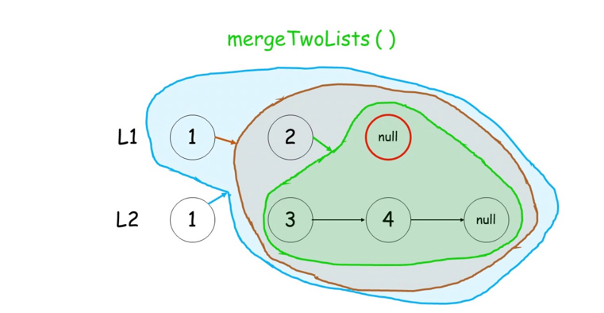

# 21. 合并两个有序列表

`Easy`

将两个升序链表合并为一个新的 **升序** 链表并返回。新链表是通过拼接给定的两个链表的所有节点组成的。

示例 1：
```
输入：l1 = [1,2,4], l2 = [1,3,4]
输出：[1,1,2,3,4,4]
```

示例 2：
```
输入：l1 = [], l2 = []
输出：[]
```

示例 3：
```
输入：l1 = [], l2 = [0]
输出：[0]
```

提示：

* 两个链表的节点数目范围是 `[0, 50]`
* `-100 <= Node.val <= 100`
* `l1` 和 `l2` 均按 非递减顺序 排列

> 来源：力扣（LeetCode）
> 
> 链接：https://leetcode.cn/problems/merge-two-sorted-lists
> 
> 著作权归领扣网络所有。商业转载请联系官方授权，非商业转载请注明出处。

## 题解

### 解法1

循环依次比较 l1，l2 的头节点，将较小节点添加到结果中，并将对应的链表后移一位。
注意引入哨兵节点，方便处理。

```java
public ListNode solution(ListNode list1, ListNode list2) {
    ListNode dummy = new ListNode(0);
    ListNode node = dummy;
    while (list1 != null && list2 != null) {
        if (list1.val > list2.val) {
            node.next = list2;
            list2 = list2.next;
        } else {
            node.next = list1;
            list1 = list1.next;
        }
        node = node.next;
    }
    if (list1 == null) {
        node.next = list2;    
    } 
    if (list2 == null) {
        node.next = list1;    
    }
    return dummy.next;
}
```

* 时间复杂度：O(n)
* 空间复杂度：O(1)

### 解法2

递归。判断 l1 和 l2 的头节点哪个更小，将较小节点的 next 指向其余节点的合并结果。

结束条件：l1 为空或者 l2 为空，直接拼接剩余链表



```java
public ListNode solution2(ListNode list1, ListNode list2) {
    if (list1 == null) return list2;
    if (list2 == null) return list1;
    if (list1.val > list2.val) {
        list2.next = solution2(list1, list2.next);
        return list2;
    } else {
        list1.next = solution2(list2, list1.next);
        return list1;
    }
}
```

* 时间复杂度：O(n)
* 空间复杂度：O(n)，递归占用的栈空间